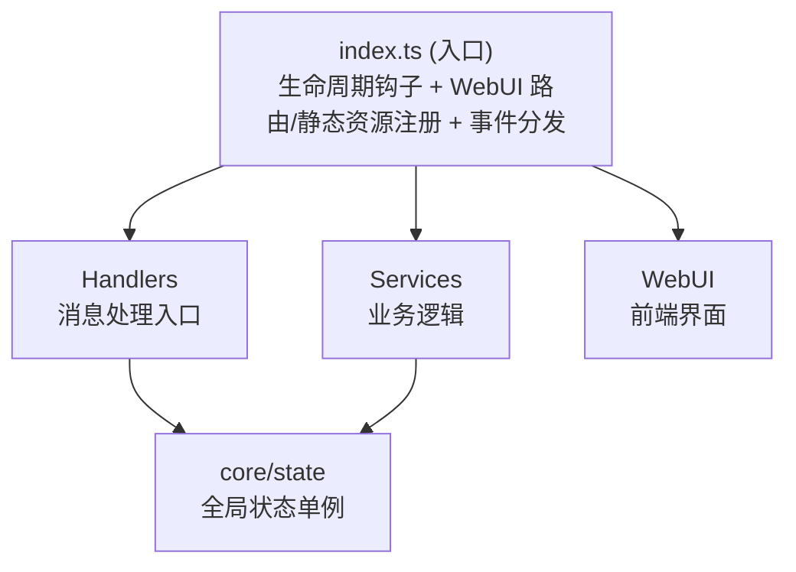

# NapCat 插件开发模板

一个快速开始 NapCat 插件开发的模板项目，基于实际生产项目架构提炼而成。

## 📁 项目结构

```
napcat-plugin-template/
├── src/
│   ├── index.ts              # 插件入口，导出生命周期函数
│   ├── config.ts             # 配置定义和 WebUI Schema
│   ├── types.ts              # TypeScript 类型定义
│   ├── core/
│   │   └── state.ts          # 全局状态管理单例
│   ├── handlers/
│   │   └── message-handler.ts # 消息处理器（命令解析、CD 冷却、消息工具）
│   ├── services/
│   │   └── api-service.ts    # WebUI API 路由（无认证模式）
│   └── webui/                # React SPA 前端（独立构建）
│       ├── index.html
│       ├── package.json
│       ├── vite.config.ts
│       ├── tailwind.config.js
│       ├── tsconfig.json
│       └── src/
│           ├── App.tsx           # 应用根组件，页面路由
│           ├── main.tsx          # React 入口
│           ├── index.css         # TailwindCSS + 自定义样式
│           ├── types.ts          # 前端类型定义
│           ├── vite-env.d.ts     # Vite 环境声明
│           ├── utils/
│           │   └── api.ts        # API 请求封装（noAuthFetch / authFetch）
│           ├── hooks/
│           │   ├── useStatus.ts  # 状态轮询 Hook
│           │   ├── useTheme.ts   # 主题切换 Hook
│           │   └── useToast.ts   # Toast 通知 Hook
│           ├── components/
│           │   ├── Sidebar.tsx       # 侧边栏导航
│           │   ├── Header.tsx        # 页面头部
│           │   ├── ToastContainer.tsx # Toast 通知容器
│           │   └── icons.tsx         # SVG 图标组件
│           └── pages/
│               ├── StatusPage.tsx  # 仪表盘页面
│               ├── ConfigPage.tsx  # 配置管理页面
│               └── GroupsPage.tsx  # 群管理页面
├── .github/
│   ├── workflows/
│   │   └── release.yml        # CI/CD 自动构建发布
│   ├── prompt/
│   │   ├── default.md             # 默认 Release Note 模板（回退用）
│   │   └── ai-release-note.md     # （可选）AI Release Note 自定义 Prompt
│   └── copilot-instructions.md  # Copilot 上下文说明
├── package.json
├── tsconfig.json
├── vite.config.ts             # Vite 构建配置（含资源复制插件）
└── README.md
```

## 🚀 快速开始

### 1. 安装依赖

```bash
pnpm install
```

### 2. 修改插件信息

编辑 `package.json`，修改以下字段：

```json
{
    "name": "napcat-plugin-your-name",
    "description": "你的插件描述",
    "author": "你的名字"
}
```

### 3. 开发你的功能

- **添加配置项**: 编辑 `src/types.ts` 和 `src/config.ts`
- **消息处理**: 编辑 `src/handlers/message-handler.ts`
- **API 路由**: 编辑 `src/services/api-service.ts`
- **状态管理**: 编辑 `src/core/state.ts`
- **WebUI 页面**: 编辑 `src/webui/src/pages/` 下的页面组件
- **WebUI 类型**: 同步更新 `src/webui/src/types.ts` 中的前端类型

### 4. 构建 & 开发

```bash
# 完整构建（自动构建 WebUI 前端 + 后端 + 资源复制，一步完成）
pnpm run build

# 仅构建 WebUI 前端（不构建后端）
pnpm run build:webui

# WebUI 前端开发服务器（实时预览，推荐纯前端开发时使用）
pnpm run dev:webui

# 类型检查
pnpm run typecheck
```

### 5. 调试 & 热重载

项目通过 Vite 插件 `napcatHmrPlugin` 集成了热重载能力（已在 `vite.config.ts` 中配置），需要在 NapCat 端安装 `napcat-plugin-debug` 插件并启用。

```bash
# 一键部署：构建 → 自动复制到远程插件目录 → 自动重载
pnpm run deploy

# 开发模式：watch 构建 + 每次构建后自动部署 + 热重载（单进程）
pnpm run dev
```

> `deploy` = `vite build`（构建完成时 Vite 插件自动部署+重载）  
> `dev` = `vite build --watch`（每次重新构建后 Vite 插件自动部署+重载）

> **注意**：`pnpm run dev` 仅监听**插件后端**（`src/` 下非 webui 的文件）的变化。修改 WebUI 前端代码后，随便改动一下后端文件即可触发重新构建（每次后端构建时会自动构建并部署 WebUI）。
>
> 如果只开发 WebUI 前端，推荐使用 `pnpm run dev:webui` 启动前端开发服务器，可实时预览。

`vite.config.ts` 中的 `copyAssetsPlugin` 会在每次构建时自动构建 WebUI 前端并复制产物，`napcatHmrPlugin()` 会自动连接调试服务 → 复制 dist/ 到远程 → 调用 reloadPlugin。

如需自定义调试服务地址或 token：

```typescript
// vite.config.ts
napcatHmrPlugin({
  wsUrl: 'ws://192.168.1.100:8998',
  token: 'mySecret',
})
```

**CLI 交互模式（可选）：**

```bash
# 独立运行 CLI，进入交互模式（REPL）
npx napcat-debug

# 交互命令
debug> list              # 列出所有插件
debug> deploy            # 部署当前目录插件
debug> reload <id>       # 重载指定插件
debug> status            # 查看服务状态
```

构建产物在 `dist/` 目录下：

```
dist/
├── index.mjs           # 插件主入口（Vite 打包）
├── package.json        # 清理后的 package.json
└── webui/              # React SPA 构建产物
    └── index.html      # 单文件 SPA（vite-plugin-singlefile）
```

## 📖 架构说明

### 分层架构



### 核心设计模式

| 模式 | 实现位置 | 说明 |
|------|----------|------|
| 单例状态 | `src/core/state.ts` | `pluginState` 全局单例，持有 ctx、config、logger |
| 服务分层 | `src/services/*.ts` | 按职责拆分业务逻辑 |
| 配置校验 | `sanitizeConfig()` | 类型安全的运行时配置验证 |
| CD 冷却 | `cooldownMap` | `Map<groupId:command, expireTimestamp>` |

## 🔧 生命周期函数

| 导出 | 说明 |
|------|------|
| `plugin_init` | 插件初始化，加载配置、注册路由 |
| `plugin_onmessage` | 消息事件处理 |
| `plugin_cleanup` | 插件卸载，清理资源 |
| `plugin_config_ui` | WebUI 配置 Schema |
| `plugin_get_config` | 获取配置 |
| `plugin_set_config` | 设置配置 |
| `plugin_on_config_change` | 配置变更回调 |

## 🌐 WebUI API 路由

模板使用 **无认证路由**（`router.getNoAuth` / `router.postNoAuth`），适用于插件自带的 WebUI 页面调用。

> NapCat 路由器提供两种注册方式：
> - `router.get` / `router.post`：需要 NapCat WebUI 登录认证
> - `router.getNoAuth` / `router.postNoAuth`：无需认证，插件 WebUI 页面可直接调用

### 内置 API 接口

| 方法 | 路径 | 说明 |
|------|------|------|
| GET | `/info` | 获取插件信息 |
| GET | `/status` | 获取运行状态、配置、统计 |
| GET | `/config` | 获取当前配置 |
| POST | `/config` | 保存配置（合并更新） |
| GET | `/groups` | 获取群列表（含启用状态） |
| POST | `/groups/:id/config` | 更新单个群配置 |
| POST | `/groups/bulk-config` | 批量更新群配置 |

### 前端调用方式

```javascript
// 无认证 API 请求
const url = `/api/plugin/${PLUGIN_NAME}${path}`;
const res = await fetch(url, {
    headers: { 'Content-Type': 'application/json' },
    ...options
});
```

## 📝 编码约定

### ESM 模块规范

- `package.json` 中 `type: "module"`
- 构建目标 `ESNext`，输出 `.mjs`

### 状态访问模式

```typescript
import { pluginState } from '../core/state';

// 读取配置
const config = pluginState.config;

// 记录日志（三级别）
pluginState.log('info', '消息内容');
pluginState.log('warn', '警告内容');
pluginState.log('error', '错误内容', error);
pluginState.logDebug('调试信息'); // 仅 debug 模式输出

// 配置操作
pluginState.setConfig(ctx, { key: value });       // 合并更新
pluginState.replaceConfig(ctx, fullConfig);        // 完整替换
pluginState.updateGroupConfig(ctx, groupId, cfg);  // 更新群配置
pluginState.isGroupEnabled(groupId);               // 检查群启用状态

// 调用 OneBot API
await pluginState.callApi('send_group_msg', { group_id, message });

// 统计
pluginState.incrementProcessedCount();
```

### 消息发送模式

```typescript
import {
    sendGroupMessage, sendPrivateMessage, sendGroupForwardMsg,
    setMsgEmojiLike, uploadGroupFile,
    textSegment, imageSegment, atSegment, replySegment, buildForwardNode
} from '../handlers/message-handler';

// 发送群消息（带回复）
await sendGroupMessage(ctx, groupId, [
    replySegment(messageId),
    textSegment('消息内容')
]);

// 合并转发消息
const nodes = [
    buildForwardNode('10001', 'Bot', [textSegment('第一条')]),
    buildForwardNode('10001', 'Bot', [textSegment('第二条')]),
];
await sendGroupForwardMsg(ctx, groupId, nodes);

// 表情回复
await setMsgEmojiLike(ctx, messageId, '76');

// 上传群文件
await uploadGroupFile(ctx, groupId, '/path/to/file.zip', 'file.zip');
```

### API 响应格式

```typescript
// 成功响应
res.json({ code: 0, data: { ... } });

// 错误响应
res.status(500).json({ code: -1, message: '错误描述' });
```

## 🤖 AI 辅助开发

项目内置了 NapCat API 的 Apifox MCP Server 配置（`.vscode/mcp.json`），在 VS Code 中配合 AI 助手（如 GitHub Copilot）使用时，可以直接查询 NapCat 的完整 API 文档。

### 使用方式

1. 使用 VS Code 打开本项目
2. 确保已安装 [GitHub Copilot](https://marketplace.visualstudio.com/items?itemName=GitHub.copilot) 扩展
3. 打开 Copilot Chat，MCP Server 会自动启动
4. 在对话中即可让 AI 查询 NapCat API 接口信息，例如：
   - *"NapCat 有哪些发送消息的 API？"*
   - *"获取群列表的接口参数是什么？"*
   - *"帮我调用 send_group_msg 发送一条群消息"*

> MCP 配置位于 `.vscode/mcp.json`，使用 `apifox-mcp-server` 连接 NapCat 的 API 文档站点，无需额外配置。

## 🚀 CI/CD 自动发布

项目内置了两个 GitHub Actions 工作流：

### 1. 自动构建发布（`release.yml`）

推送 `v*` 格式的 tag 即可自动构建并创建 GitHub Release。

```bash
git tag v1.0.0
git push origin v1.0.0
```

也可在 GitHub Actions 页面手动触发，可选填版本号。

**基础自定义：**
- 修改 `release.yml` 中的 `PLUGIN_NAME` 为你的插件名称
- 默认 Release Note 模板位于 `.github/prompt/default.md`

#### 🤖 AI 生成 Release Note（可选）

支持接入任意兼容 OpenAI 格式的 AI API，自动根据 git commit 记录生成结构化的 Release Note。

**配置方式：** 在插件仓库 **Settings > Secrets and variables > Actions** 中添加以下 Secrets：

| Secret | 必填 | 说明 |
|--------|------|------|
| `AI_API_URL` | ✅ | 兼容 OpenAI 格式的 API 地址（如 `https://api.openai.com/v1/chat/completions`） |
| `AI_API_KEY` | ✅ | 对应的 API 密钥 |
| `AI_MODEL` | ❌ | 模型名称，默认 `gpt-4o-mini` |

**工作逻辑：**
- ✅ 配置了 `AI_API_URL` + `AI_API_KEY` → 自动调用 AI 生成 Release Note
- ❌ 未配置或 AI 调用失败 → 自动回退到默认模板（`.github/prompt/default.md`）或 commit log
- AI 调用失败不会阻断发布流程，始终保证 Release 正常创建

**自定义 AI Prompt：** 创建 `.github/prompt/ai-release-note.md` 文件即可覆盖默认的 system prompt，支持 `{VERSION}` 占位符。

> 💡 不配置任何 AI 相关的 Secret，发布流程与之前完全一致，无任何影响。

### 2. 自动更新插件索引（`update-index.yml`）

Release 发布后，会自动向 [napcat-plugin-index](https://github.com/NapNeko/napcat-plugin-index) 提交 PR 更新插件索引，**无需手动编辑 `plugins.v4.json`**。

**完整流程：**

```
push tag → release.yml 构建发布 → update-index.yml 自动提交 PR → 索引仓库 CI 自动审核 → 维护者合并
```

**配置步骤：**

1. **填写 `package.json` 中的插件元信息**（CI 会自动读取）：
   ```json
   {
     "name": "napcat-plugin-your-name",
     "plugin": "你的插件显示名",
     "version": "1.0.0",
     "description": "插件描述",
     "author": "你的名字",
     "napcat": {
       "tags": ["工具"],
       "minVersion": "4.14.0",
       "homepage": "https://github.com/username/napcat-plugin-your-name"
     }
   }
   ```

   `napcat` 字段说明：

   | 字段 | 说明 | 默认值 |
   |------|------|--------|
   | `tags` | 插件标签数组，用于分类 | `["工具"]` |
   | `minVersion` | 支持的最低 NapCat 版本 | `"4.14.0"` |
   | `homepage` | 插件主页 URL | 仓库地址 |

2. **配置仓库 Secret**：在插件仓库 Settings > Secrets and variables > Actions 中添加：
   - `INDEX_PAT`：一个有 `public_repo` 权限的 GitHub Personal Access Token，用于向索引仓库提交 PR

3. **修改 `update-index.yml`**（可选）：如果索引仓库不是 `NapNeko/napcat-plugin-index`，修改 `INDEX_REPO` 环境变量

> 💡 配置完成后，每次发布新版本只需 `git tag v1.x.x && git push origin v1.x.x`，一切自动完成！

## 📦 部署

### 方式一：一键部署（推荐开发时使用）

确保 NapCat 端已安装并启用 `napcat-plugin-debug` 插件，然后：

```bash
pnpm run deploy
```

这会自动构建，`napcatHmrPlugin` 在构建完成后自动复制 `dist/` 到远程插件目录并触发热重载。

### 方式二：手动部署

将 `dist/` 目录的内容复制到 NapCat 的插件目录即可。

> 💡 使用 CI/CD 自动发布后，可直接从 GitHub Release 下载 zip 包解压到 `plugins` 目录。

## 📄 许可证

MIT License
